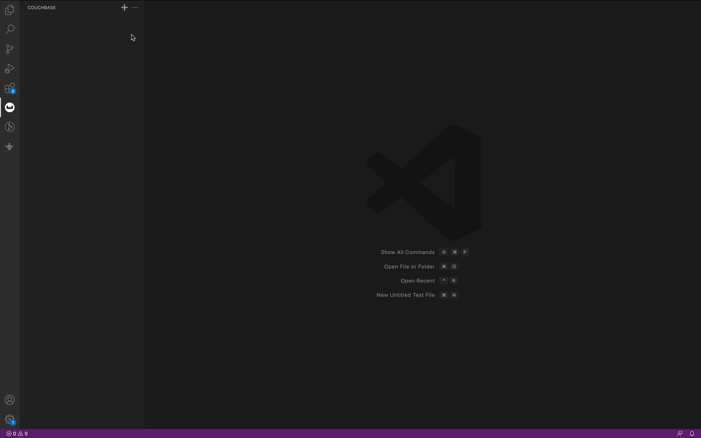
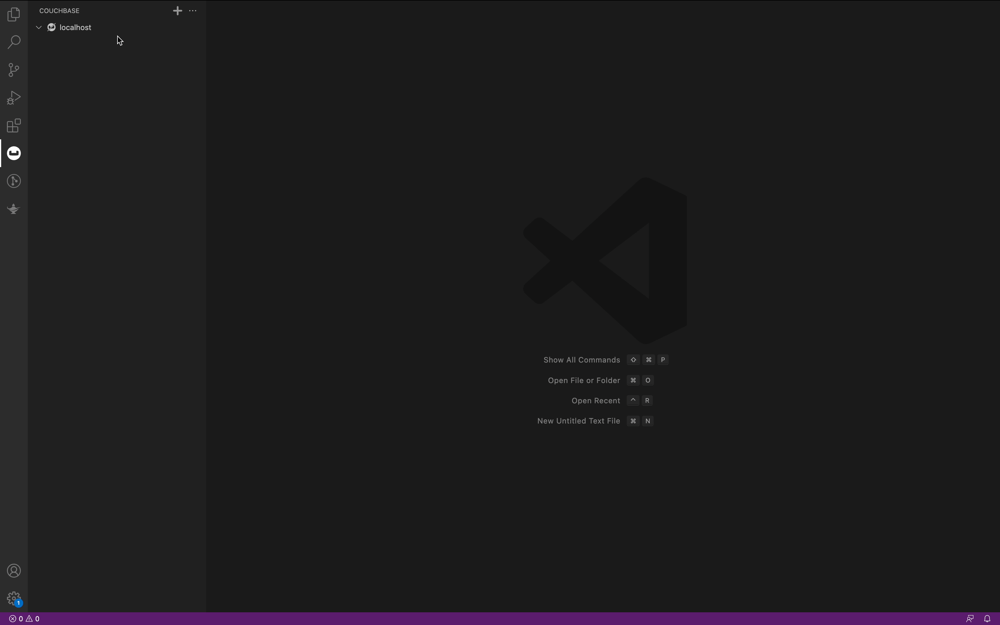
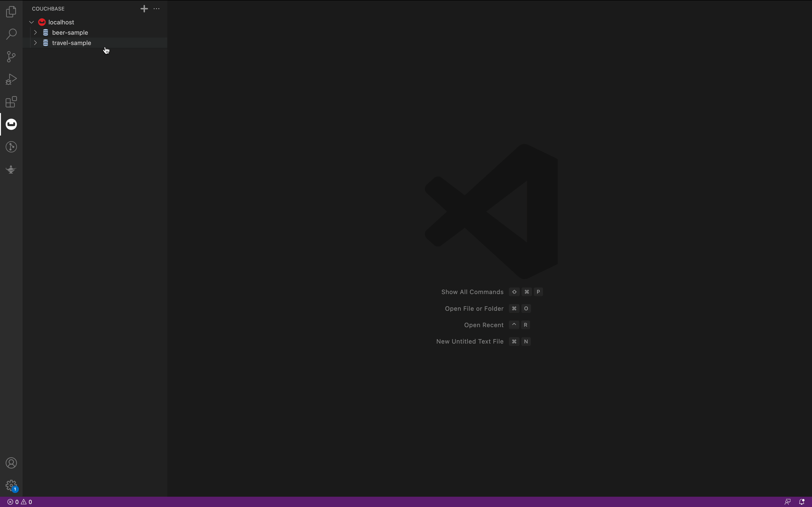

# VSCode-Couchbase README

Welcome to the official Visual Studio Code extension for Couchbase!

This extension is designed to provide a seamless experience for Couchbase Server users who want to work within the popular Visual Studio Code editor. 

# Requirements
This extension requires OpenSSL to be installed on your system in order to install successfully. 

For Windows:
- Download the latest version of OpenSSL from https://slproweb.com/products/Win32OpenSSL.html and follow the installation instructions.

For Debian or Ubuntu-based distros::
- Run `sudo apt-get install openssl`

For Red Hat, CentOS or Fedora-based distros:
-  Run `sudo dnf install openssl` (on newer Fedora versions), OR `sudo yum install openssl` (on older Fedora/Red Hat/CentOS versions)

For Mac:
- Run `brew install openssl` using Homebrew, or download the latest version of OpenSSL from https://www.openssl.org/source/ and follow the installation instructions.

If you face problem with installation check Trouble Shoot Guidelines

> :warning:  **WARNING**:  DO NOT upgrade cmake-js to 7.x or it will break Windows builds. Please use 6.x instead. 

# Quick Tour

### Add Cluster Connection
Click on add icon, fill the required details and click on connect.

### Connect, Disconnect or Delete a Cluster Connection
Open the context menu on the connection and you can get options to Connect, Disconnect or Delete the Cluster.

### Interact with Buckets and Scopes
Click on the bucket and you would be able to see Scopes under that bucket. Open the context menu on bucket to Create a Scope, Refresh Scopes or to get Bucket Administrative Information.

### Interact with Collections and Indexes
Click on Scope to see Collections and Indexes. Open context menu on Collection directory to open a new Index

### Interact wiht Documents
Click on a Collection to see documents. Click on a document to open it.
Open context menu on Collection to create or search a Document. Use Ctrl + S or Cmd + S to save the document.

### Open SQL++ Notebook
Open context menu on Cluster and Click on New SQL++ Notebook to get a notebook.

## License
Apache Software License Version 2.  See individual files for details.