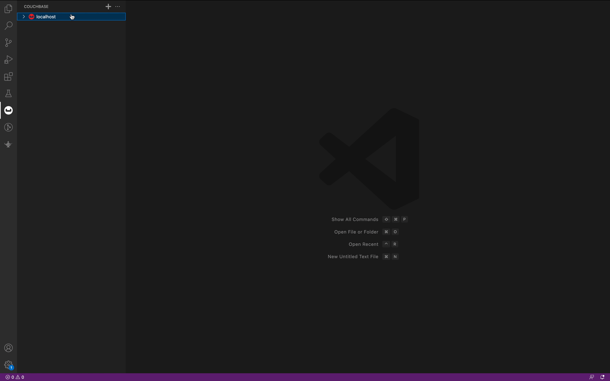
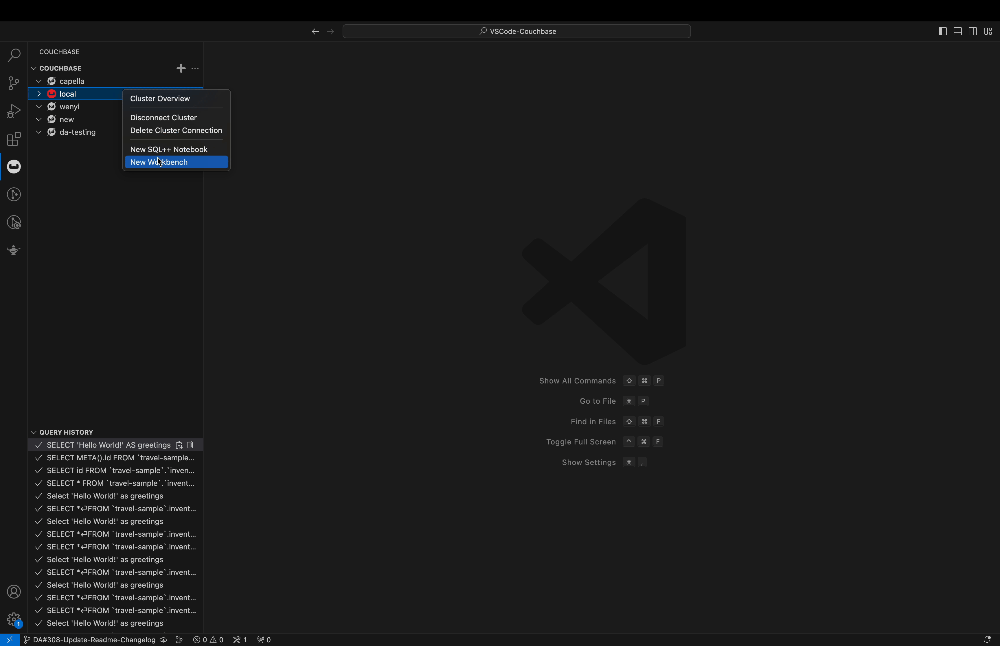

# VSCode-Couchbase README

Welcome to the official Visual Studio Code extension for Couchbase!

This extension is designed to provide a seamless experience for Couchbase Server users who want to work within the popular Visual Studio Code editor. 

# Requirements
Most of the requirements are taken care in the build. For Linux users a latest version of glibc may be required depending on the distro.

# Quick Tour

### Add Cluster Connection
To connect to a Couchbase Cluster, follow these steps:
1. Click on the "Add" icon.
2. Complete all the required fields with the necessary details.
3. Check "Use Secure Connection" if you are connecting to Capella.
4. Finally, click on the "Connect" button to establish a connection to the cluster.

### Connect, Disconnect or Delete a Cluster Connection
Right-click on the connection to open the context menu. From the context menu, you will be able to choose between options to Connect, Disconnect or Delete the Cluster.

### Interact with Buckets and Scopes
Click on the bucket to see the list of Scopes associated with that bucket. Open the context menu on bucket to undertake actions such as creating a new Scope, refreshing existing Scopes, or obtaining administrative information about the Bucket.

### Interact with Collections and Indexes
Click on Scope to list Collections and Indexes. Open context menu on Collection directory to create a new Collection or to refresh Collections.

### Interact with Documents
1. Click on the desired Collection to list all the documents that have been stored within it.
2. To open a specific document, click on it to view its details and make any necessary changes.
3. If you need to create a new document or search for an existing one, you can open the context menu by right-clicking on the Collection directory.
4. Once you have made any necessary changes to a document, you can save it using the "Ctrl + S" or "Cmd + S" shortcut keys.

### Capella iQ
1. Use iQ natively in your extension. Sign in with your capella credentials and choose the iQ enabled org
2. A Chatbot which knows about couchbase and can help you with your SDK Code, Query, and more couchbase related stuff.
3. It knows context of your connected database. And give you more specfic results for your questions
4. Select a code related to couchbase query or SDK to ask more about it.
5. Use actions to open stuff in VSCode. Send feedback to the team for improvements.

### Open SQL++ Notebook
1. Simply right-click on the Cluster and select the "New SQL++ Notebook" option from the context menu.
2. Once you have opened the notebook, you will be presented with a powerful text editor that allows you to craft your SQL++ queries with ease.
3. And once you have completed your work, you can save the notebook to your local machine for future reference.

### SQL++ Workbench
1. Fully functional workbench to run SQL++ query and see result in Tabular, JSON and Explain Plan format.
2. Query History to see last executed query.
3. Favourite your query and set Query context.

### Data Export, Import and DDL Export Tools
1. Use Data Export to export particular bucket, scope or collections in your choice of format
2. Use Data Import to import data in your required bucket.
3. Use DDL export to export all bucket and indexes details as Query and run those queries to create a replica
4. Complete bucket cloning is now possible, right from the VSCode. Just do DDL Export and Data Export of the particular bucket. Then run the DDL Export queries for the target bucket and then Data Import to send all data in the newer bucket

## License
Apache Software License Version 2.  See individual files for details.
